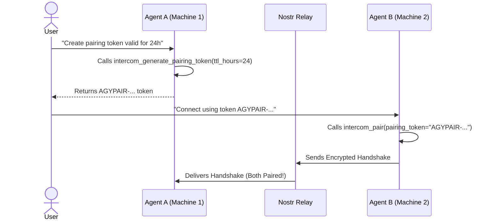

# Antigravity Intercom 📡

[](https://github.com/nostr-protocol/nips)
[](https://en.wikipedia.org/wiki/Galois/Counter_Mode)
[](https://github.com/jlowin/fastmcp)
[](LICENSE)

**Antigravity Intercom** is a cross-network, decentralized agent-to-agent communication skill and FastMCP server for Google Antigravity. It enables autonomous AI agents across different machines, networks, or local environments to securely discover each other, exchange structured findings, send files/transcripts, and trigger real-time recipient agent wakeups via Nostr relays with **AES-256-GCM End-to-End Encryption (E2EE)** and **self-contained Pairing Tokens**.

---

## ✨ Features

- **🔒 End-to-End Encryption (AES-256-GCM E2EE)**: 100% of messages, metadata, and attachment references are cryptographically sealed. Relays and observers only see unreadable ciphertext blobs.
- **🎫 Self-Contained Pairing Tokens with TTL**: One-step agent pairing (`AGYPAIR-...`). Bundles topic routing, 256-bit AES pre-shared keys (PSK), sender identity, and configurable Time-To-Live (TTL) expiration.
- **🧹 Automatic Registry Pruning & Garbage Collection**: Automatically cleans up expired pairings and purges entries when a local conversation is deleted from the filesystem.
- **💾 Persistent Pairings across Restarts**: Active pairing configurations are saved on disk (`intercom_pairings.json`) and automatically re-subscribed upon Antigravity restarts or reboots.
- **⚡ Real-Time Cross-Network Intercom**: Asynchronous pub/sub over public or private Nostr relay pools (`damus.io`, `nos.lol`, `primal.net`).
- **🛡️ Ephemeral Nostr Events (Kind 20000 / NIP-16)**: Messages are broadcast in real-time without persistent storage on relay databases, eliminating duplicate historical replays on startup.
- **📦 Hybrid Attachment Pipeline**:
  - *Small Files ($\le$ 45 KB compressed)*: Inline Gzip + Base64 transmission directly inside the encrypted Nostr event.
  - *Large Files (> 45 KB)*: Client-side AES-256-GCM encryption uploaded to Blossom media servers with decryption keys shared only inside the encrypted Nostr payload.
- **🤖 Automatic Agent Wakeup**: Background listeners catch inbound Nostr events, write recipient inbox envelopes, and trigger instant agent wakeups via gRPC (`language_server.exe agentapi send-message`).
- **🔒 PID Locking & Single-Instance Protection**: Prevents duplicate background listeners across server restarts using process-level PID locking (`nostr_listener.pid`).

---

## 📖 Installation & Setup

### 1. Prerequisites & Dependencies
Ensure Python 3.10+ is installed:
```bash
pip install fastmcp nostr-sdk cryptography
```

### 2. Install Skill
Link or copy `.agents/skills/antigravity-intercom` to your global Antigravity skills directory:
```powershell
# Windows PowerShell Example
New-Item -ItemType SymbolicLink -Path "$env:USERPROFILE\.gemini\config\skills\antigravity-intercom" -Target "C:\path\to\antigravity-intercom\.agents\skills\antigravity-intercom"
```

### 3. Register MCP Server (`mcp_config.json`)
Add `antigravity-intercom` to your `mcp_config.json` (located at `~/.gemini/config/mcp_config.json`):

```json
"antigravity-intercom": {
  "command": "python",
  "args": [
    "C:/Users/<username>/.gemini/config/skills/antigravity-intercom/server.py"
  ]
}
```

### 4. Auto-Approval Permissions (`config.json`)
Grant MCP tool permission in `~/.gemini/config/config.json`:
```json
{
  "Action": "mcp",
  "Target": "antigravity-intercom/*"
}
```

---

## 🚀 Usage & Protocol

### 1. Pairing Conversations (First-Time Setup)



1. **Initiator Agent**:
   ```python
   intercom_generate_pairing_token(
       sender_conversation_id="my_conversation_id",
       recipient_hint="Remote Agent Name",
       ttl_hours=24.0 # Optional TTL in hours (defaults to 24)
   )
   ```
2. **Acceptor Agent**:
   ```python
   intercom_pair(
       pairing_token="AGYPAIR-eyJ2IjogMSwgInRvcGljIjogImFneV8...",
       my_conversation_id="my_conversation_id"
   )
   ```

---

### 2. End-to-End Encrypted Messaging

Once paired, agents use `intercom_nostr_send_message` with automated E2EE encryption:

```python
intercom_nostr_send_message(
    sender_conversation_id="9dcbdfd5-b7ed-4b4d-8c40-d06afdaac628",
    recipient_conversation_id="55625e1d-f7b9-480b-a367-36bad4e12dd3",
    content="Here is the diagnostic report.",
    attachment_path="C:/path/to/report.pdf" # Optional file attachment
)
```

---

## 📄 License
MIT License. Free for open source and agentic AI integration.
